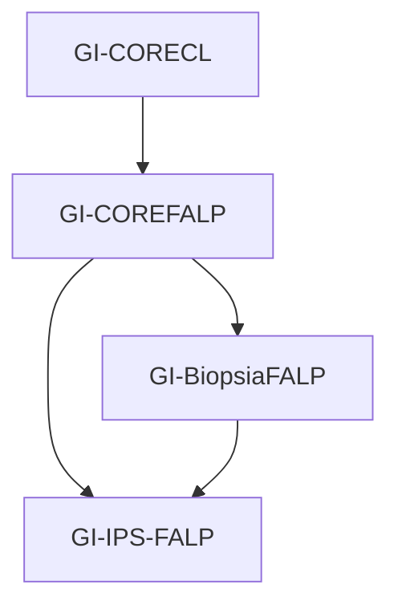

### Objetivos

El principal objetivo de esta guía es determinar los requerimientos mínimos que requieren los resumenes IPS para la fundación. Cualquier resumen IPS que se desee implementar deberá utilizar los perfiles de esta guía, además de los otrs perfiles disponibles la guía CORE de la fundación.

Esta guía fue realizada por la Fundación Arturo López Pérez y la Universidad de Valparaíso, por medio de un convenio entre ambas instituciones. 

## Otras guías FALP

Existen otras dos guías de implementación realizadas por la fundación, que buscan modelar el seguimiento de un paciente durante su viaje. En el diagrama, se muestra la relación entre estas guías y la CORE nacional:

Se deberá en continuar desarrollando guías para los diferentes casos de uso que necesite la FALP 

### Trabajo Futuro 

Como trabajo futuro para esta guía se plantea:

* Especificación de la guía: Los perfiles son generales, por lo que se debe trabajar en conjunto con la fundación para obtener los datos que llos requerien, analizar si deben haber cambios y realizar las modificaciones en caso de ser necesario.
* Determinar terminologías: Se utilizaron las mismas terminologías que especifica IPS, por lo que se debe analizar si la fundación desea utilizar otras terminologías distintas. 
